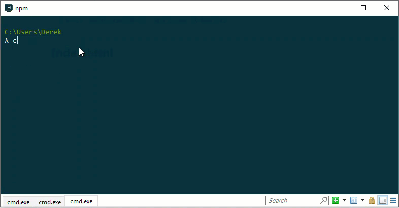
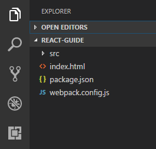
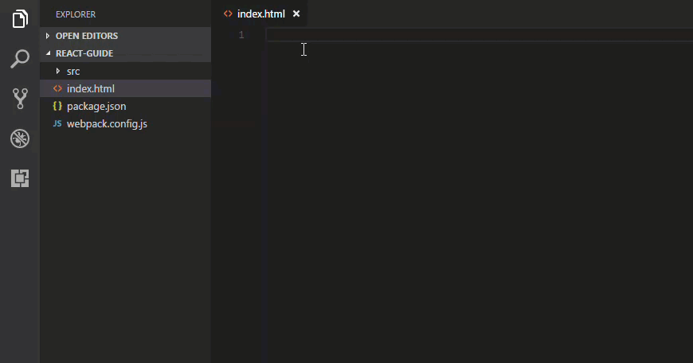

# Project Structure

---

Make a new project directory and add a `package.json` file with `npm init`.

```bash
# make project directory
$ mkdir react-guide

# navigate to project directory
$ cd react-guide 

# create package.json file.
$ npm init -y
```



Open in VSCode and create the following project structure

```bash
$ code .
```

```
react-guide/
|- src/
|- index.html
|- package.json
|- webpack.config.js
```



## Index.html

---



```html
<!DOCTYPE html>
<html lang="en">
<head>
    <meta charset="UTF-8">
    <meta name="viewport" content="width=device-width, initial-scale=1.0">
    <meta http-equiv="X-UA-Compatible" content="ie=edge">
    <title>React Guide</title>
</head>
<body>
    <div id="react-app"></div>
</body>
</html>
```

## Package.json

Add the following devDependencies and build script to `package.json`.

```json
{
  "name": "react-guide",
  "version": "1.0.0",
  "description": "",
  "main": "index.js",
  "devDependencies": {
    "babel-core": "^6.26.0",
    "babel-loader": "^7.1.2",
    "babel-plugin-transform-class-properties": "^6.24.1",
    "babel-plugin-transform-decorators-legacy": "^1.3.4",
    "babel-preset-env": "^1.6.1",
    "babel-preset-react": "^6.24.1",
    "bootstrap": "^3.3.7",
    "css-loader": "^0.28.9",
    "extract-text-webpack-plugin": "^3.0.2",
    "file-loader": "^1.1.6",
    "isomorphic-fetch": "^2.2.1",
    "react": "^16.2.0",
    "react-dom": "^16.2.0",
    "react-router-dom": "^4.2.2",
    "style-loader": "^0.16.1",
    "uglifyjs-webpack-plugin": "^1.1.8",
    "url-loader": "^0.5.8",
    "webpack": "^4.0.1",
    "webpack-cli": "^2.0.10",
    "webpack-dev-server": "^3.1.0",
    "webpack-hot-middleware": "^2.21.1"
  },
  "scripts": {
    "test": "echo \"Error: no test specified\" && exit 1",
    "build": "webpack --mode development"
  },
  "keywords": [],
  "author": "",
  "license": "ISC"
}
```

Don't forget to run `$ npm install` to download all the dependencies.

## Webpack.config.js

Covered in the [next section](/build.md).

